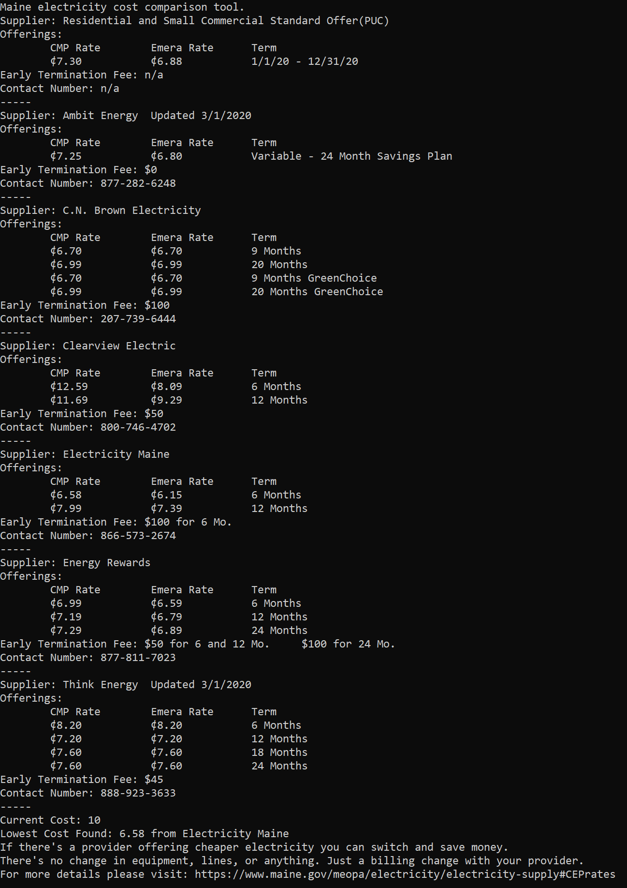

README
---
This app was written to assist users with finding cheaper power in states with deregulated energy markets. Currently only Maine is supported.

How does it work?
---
For Maine it checks [this site](https://www.maine.gov/meopa/electricity/electricity-supply) to determine what providers are currently offering power, and at what price. If any are found with cheaper offerings than your current provider, it will tell you.

Usage
---
There are two ways to use this app.

1. Double click the app. You'll be prompted to input your current cost and power company.

2. Run the app in the terminal using `./electricutility -current=currentkWhCost -provider=providerName`. Eg: `./electricutility -current=7.56 -provider=CMP`

Don't want to do all this manually?
---
[Arcadia Power](https://www.arcadia.com/referral/?promo=shawn9811) does this automatically at no charge to you, just sign up and link your electric utility account with them. You'll also get up to $25 off your first electric bill after enrolling by signing up with my [referral link](https://www.arcadia.com/referral/?promo=shawn9811).

Sample Output
---
